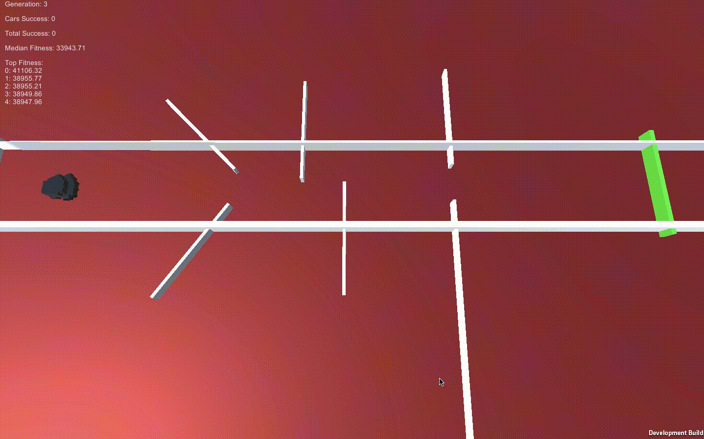

# DeepNeuroevolutionCars
## Self Driving Car Simulation Using Unity3D and C#. Algorithm based on the one described in 
["Deep Neuroevolution: Genetic Algorithms Are a Competitive Alternative for Training Deep Neural Networks for Reinforcement Learning"](https://arxiv.org/abs/1712.06567)

### Cars
#### The cars have 9 sensors measuring distance from objects. They feed the distances to a neural network and determine the best steer angle and speed. They also have a living cost, if they dont reach the goal they die and receive negative reward

### Environment
#### The environment is pretty simple. The cars have to dodge a couple walls and reach the green goal.

### Results

### Cars start off making random actions

### The best generation then creates children, so the median fitness increases after a couple generations

### After a couple more generations most of the car agents are reaching the goal and the median reward is over 100k.

